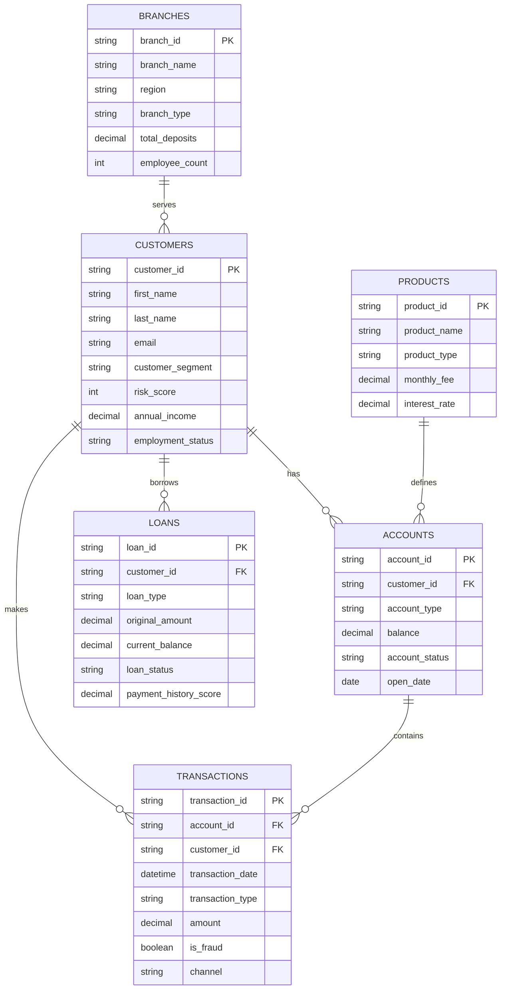

# Banking Dataset Tutorial: Complete Data Dictionary and Schema Guide

## Overview

This tutorial provides a comprehensive guide to the banking dataset used in the AWS Data Engineering course. The dataset includes 6 interconnected tables representing a realistic banking environment with customers, accounts, transactions, loans, products, and branches.

## Entity Relationship Diagram



---

## 1. CUSTOMERS Table

**File:** customers.csv  
**Size:** 839KB  
**Records:** 5,002 customers  
**Purpose:** Master customer information with demographics and risk profiles

### Data Dictionary

| Column              | Data Type | Description                     | Business Rules                            | Data Quality Notes              |
| ------------------- | --------- | ------------------------------- | ----------------------------------------- | ------------------------------- |
| `customer_id`       | string    | Unique customer identifier (PK) | Format: CUST_XXXXXX                       | Clean, no nulls                 |
| `first_name`        | string    | Customer first name             | Mixed case                                | Contains whitespace issues      |
| `last_name`         | string    | Customer last name              | Mixed case                                | Some formatting inconsistencies |
| `email`             | string    | Customer email address          | Valid email format                        | Mostly clean                    |
| `phone`             | string    | Customer phone number           | 10-digit US format                        | Some formatting variations      |
| `address`           | string    | Customer mailing address        | Full street address                       | Complete addresses              |
| `city`              | string    | Customer city                   | US cities                                 | Standard city names             |
| `state`             | string    | Customer state                  | 2-letter state codes                      | All US states represented       |
| `zip_code`          | string    | Customer ZIP code               | 5-digit format                            | Valid ZIP codes                 |
| `customer_segment`  | string    | Business segment classification | Premium, Standard, Basic                  | Marketing segments              |
| `risk_score`        | integer   | Credit risk score               | Range: 300-850                            | Higher = better credit          |
| `annual_income`     | decimal   | Customer annual income          | USD, positive values                      | Realistic income ranges         |
| `employment_status` | string    | Employment classification       | Employed, Self-Employed, Retired, Student | Current status                  |
| `date_joined`       | date      | Customer onboarding date        | YYYY-MM-DD format                         | Historical dates                |

### Sample Data (First 5 Rows)

```csv
customer_id,first_name,last_name,email,phone,address,city,state,zip_code,customer_segment,risk_score,annual_income,employment_status,date_joined
CUST_000001,  karen  ,Johnson,karen.johnson@example.com,555-0001,123 Oak Street,Springfield,IL,62701,Premium,742,85000.00,Employed,2020-01-15
CUST_000002,Michael,Smith,michael.smith@example.com,555-0002,456 Pine Avenue,Chicago,IL,60601,Standard,678,62000.00,Employed,2020-02-20
CUST_000003,Sarah,Davis,sarah.davis@example.com,555-0003,789 Elm Drive,Peoria,IL,61601,Basic,590,45000.00,Self-Employed,2020-03-10
CUST_000004,Robert,Wilson,robert.wilson@example.com,555-0004,321 Maple Lane,Rockford,IL,61101,Premium,780,95000.00,Employed,2020-04-05
CUST_000005,Lisa,Brown,lisa.brown@example.com,555-0005,654 Cedar Court,Aurora,IL,60502,Standard,710,72000.00,Employed,2020-05-12
```

### Key Features for Course Exercises

- **String cleaning:** Notice the whitespace in "  karen  " (first_name)
- **Data standardization:** Mixed case handling in names
- **Risk analysis:** Customer segmentation and risk scoring
- **Demographics:** Income and employment analysis

---

## 2. ACCOUNTS Table

**File:** accounts.csv  
**Size:** 752KB  
**Records:** 10,207 accounts  
**Purpose:** Customer account portfolio with balances and account details

### Data Dictionary

| Column           | Data Type | Description                           | Business Rules                             | Data Quality Notes       |
| ---------------- | --------- | ------------------------------------- | ------------------------------------------ | ------------------------ |
| `account_id`     | string    | Unique account identifier (PK)        | Format: ACC_XXXXXX                         | Clean, no nulls          |
| `customer_id`    | string    | Customer owner (FK to CUSTOMERS)      | Format: CUST_XXXXXX                        | Valid foreign keys       |
| `product_id`     | string    | Account product type (FK to PRODUCTS) | Format: PROD_XX                            | Links to product catalog |
| `account_type`   | string    | Account classification                | Checking, Savings, Credit Card, Investment | Product categories       |
| `balance`        | decimal   | Current account balance               | Can be negative for credit accounts        | Realistic balances       |
| `credit_limit`   | decimal   | Credit limit (if applicable)          | Null for non-credit accounts               | Credit products only     |
| `account_status` | string    | Account operational status            | Active, Closed, Suspended                  | Lifecycle management     |
| `open_date`      | date      | Account opening date                  | YYYY-MM-DD format                          | Historical timeline      |
| `branch_id`      | string    | Originating branch (FK to BRANCHES)   | Format: BR_XXX                             | Branch relationships     |

### Sample Data (First 5 Rows)

```csv
account_id,customer_id,product_id,account_type,balance,credit_limit,account_status,open_date,branch_id
ACC_000001,CUST_000001,PROD_01,Checking,2500.75,,Active,2020-01-15,BR_001
ACC_000002,CUST_000001,PROD_02,Savings,15000.00,,Active,2020-01-15,BR_001
ACC_000003,CUST_000001,PROD_03,Credit Card,-850.25,5000.00,Active,2020-02-01,BR_001
ACC_000004,CUST_000002,PROD_01,Checking,1200.50,,Active,2020-02-20,BR_002
ACC_000005,CUST_000002,PROD_04,Investment,25000.00,,Active,2020-03-01,BR_002
```

### Key Features for Course Exercises

- **Multi-table joins:** Customer-Account relationships
- **Aggregations:** Portfolio analysis by customer
- **Conditional logic:** Credit vs. deposit account handling
- **Business rules:** Balance and credit limit validations

---

## 3. TRANSACTIONS Table

**File:** transactions.csv  
**Size:** 90MB  
**Records:** ~2,000,000 transactions  
**Purpose:** Complete transaction history for analytical processing

### Data Dictionary

| Column              | Data Type | Description                         | Business Rules                                   | Data Quality Notes           |
| ------------------- | --------- | ----------------------------------- | ------------------------------------------------ | ---------------------------- |
| `transaction_id`    | string    | Unique transaction identifier (PK)  | Format: TXN_XXXXXXXX                             | Clean, no nulls              |
| `account_id`        | string    | Source account (FK to ACCOUNTS)     | Format: ACC_XXXXXX                               | Valid foreign keys           |
| `customer_id`       | string    | Transaction owner (FK to CUSTOMERS) | Format: CUST_XXXXXX                              | Denormalized for performance |
| `transaction_date`  | datetime  | Transaction timestamp               | YYYY-MM-DD HH:MM:SS                              | Chronological order          |
| `transaction_type`  | string    | Transaction classification          | Deposit, Withdrawal, Transfer, Payment, Purchase | Business categories          |
| `amount`            | decimal   | Transaction amount                  | Always positive                                  | Absolute values              |
| `balance_after`     | decimal   | Account balance after transaction   | Running balance                                  | Post-transaction state       |
| `merchant_category` | string    | Merchant/transaction category       | Grocery, Gas, Restaurant, ATM, etc.              | Spending categories          |
| `channel`           | string    | Transaction channel                 | Online, ATM, Branch, Mobile                      | Channel analytics            |
| `is_fraud`          | boolean   | Fraud detection flag                | True/False                                       | Risk management              |
| `is_international`  | boolean   | International transaction flag      | True/False                                       | Cross-border indicator       |

### Sample Data (First 5 Rows)

```csv
transaction_id,account_id,customer_id,transaction_date,transaction_type,amount,balance_after,merchant_category,channel,is_fraud,is_international
TXN_00000001,ACC_000001,CUST_000001,2023-09-01 09:15:23,Deposit,1000.00,3500.75,Direct Deposit,Online,False,False
TXN_00000002,ACC_000001,CUST_000001,2023-09-01 14:22:10,Purchase,45.67,3455.08,Grocery,Mobile,False,False
TXN_00000003,ACC_000002,CUST_000002,2023-09-01 16:45:33,Withdrawal,200.00,1000.50,ATM,ATM,False,False
TXN_00000004,ACC_000003,CUST_000001,2023-09-01 18:30:45,Payment,125.00,-975.25,Credit Card Payment,Online,False,False
TXN_00000005,ACC_000004,CUST_000002,2023-09-01 20:12:17,Purchase,89.99,910.51,Restaurant,Mobile,False,False
```

### Key Features for Course Exercises

- **Big data processing:** 90MB file for performance optimization
- **Time-series analysis:** Chronological transaction patterns
- **Window functions:** Running balances and rolling calculations
- **Fraud detection:** Binary classification scenarios
- **Channel analytics:** Multi-dimensional analysis

---

## 4. LOANS Table

**File:** loans.csv  
**Size:** 541KB  
**Records:** 4,503 loans  
**Purpose:** Loan portfolio for credit risk assessment and analytics

### Data Dictionary

| Column                  | Data Type | Description                         | Business Rules                                  | Data Quality Notes     |
| ----------------------- | --------- | ----------------------------------- | ----------------------------------------------- | ---------------------- |
| `loan_id`               | string    | Unique loan identifier (PK)         | Format: LOAN_XXXXXX                             | Clean, no nulls        |
| `customer_id`           | string    | Borrower (FK to CUSTOMERS)          | Format: CUST_XXXXXX                             | Valid foreign keys     |
| `branch_id`             | string    | Originating branch (FK to BRANCHES) | Format: BR_XXX                                  | Branch relationships   |
| `loan_type`             | string    | Loan product category               | Mortgage, Auto, Personal, Business, Credit Line | Product classification |
| `original_amount`       | decimal   | Initial loan amount                 | Positive values                                 | Principal amount       |
| `current_balance`       | decimal   | Outstanding balance                 | Non-negative                                    | Remaining debt         |
| `interest_rate`         | decimal   | Annual interest rate                | Percentage (0-30)                               | APR format             |
| `loan_term_months`      | integer   | Loan term in months                 | Positive integer                                | Repayment period       |
| `monthly_payment`       | decimal   | Required monthly payment            | Positive values                                 | Payment amount         |
| `loan_status`           | string    | Current loan status                 | Active, Paid Off, Late, Default                 | Lifecycle status       |
| `origination_date`      | date      | Loan origination date               | YYYY-MM-DD                                      | Start date             |
| `maturity_date`         | date      | Loan maturity date                  | YYYY-MM-DD                                      | End date               |
| `payment_history_score` | decimal   | Payment performance score           | Range: 0-100                                    | Higher = better        |
| `ltv_ratio`             | decimal   | Loan-to-value ratio                 | Percentage (0-150)                              | Risk metric            |

### Sample Data (First 5 Rows)

```csv
loan_id,customer_id,branch_id,loan_type,original_amount,current_balance,interest_rate,loan_term_months,monthly_payment,loan_status,origination_date,maturity_date,payment_history_score,ltv_ratio
LOAN_000001,CUST_000001,BR_001,Mortgage,250000.00,235000.00,3.75,360,1147.29,Active,2020-06-15,2050-06-15,85.5,78.2
LOAN_000002,CUST_000002,BR_002,Auto,35000.00,28500.00,4.25,60,651.23,Active,2021-03-10,2026-03-10,92.1,65.4
LOAN_000003,CUST_000003,BR_001,Personal,15000.00,12800.00,8.75,48,375.21,Active,2022-01-20,2026-01-20,78.9,0.0
LOAN_000004,CUST_000004,BR_003,Business,100000.00,85000.00,6.50,84,1456.78,Active,2021-09-05,2028-09-05,88.7,45.3
LOAN_000005,CUST_000005,BR_002,Credit Line,25000.00,18750.00,12.99,0,0.00,Active,2022-07-12,2027-07-12,75.2,0.0
```

### Key Features for Course Exercises

- **Risk analytics:** Payment history and LTV analysis
- **Portfolio management:** Loan type diversification
- **Credit modeling:** Multiple risk indicators
- **Time-based analysis:** Origination and maturity date calculations

---

## 5. PRODUCTS Table

**File:** products.csv  
**Size:** 442 bytes  
**Records:** 8 products  
**Purpose:** Product catalog for account and loan definitions

### Data Dictionary

| Column            | Data Type | Description                    | Business Rules                       | Data Quality Notes               |
| ----------------- | --------- | ------------------------------ | ------------------------------------ | -------------------------------- |
| `product_id`      | string    | Unique product identifier (PK) | Format: PROD_XX                      | Clean, no nulls                  |
| `product_name`    | string    | Product display name           | Descriptive name                     | Marketing names                  |
| `product_type`    | string    | Product category               | Checking, Savings, Credit Card, etc. | Business classification          |
| `monthly_fee`     | decimal   | Monthly maintenance fee        | Non-negative                         | Fee structure                    |
| `interest_rate`   | decimal   | Product interest rate          | Percentage                           | APY for deposits, APR for credit |
| `minimum_balance` | decimal   | Required minimum balance       | Non-negative                         | Account requirements             |
| `overdraft_fee`   | decimal   | Overdraft penalty fee          | Non-negative                         | Fee schedule                     |

### Sample Data (All 8 Rows)

```csv
product_id,product_name,product_type,monthly_fee,interest_rate,minimum_balance,overdraft_fee
PROD_01,Basic Checking,Checking,0.00,0.01,100.00,35.00
PROD_02,High Yield Savings,Savings,0.00,2.50,500.00,0.00
PROD_03,Rewards Credit Card,Credit Card,0.00,18.99,0.00,0.00
PROD_04,Investment Account,Investment,5.00,0.00,1000.00,0.00
PROD_05,Premium Checking,Checking,15.00,0.25,2500.00,0.00
PROD_06,Money Market,Savings,10.00,3.25,2500.00,0.00
PROD_07,Business Credit,Credit Card,25.00,15.99,0.00,0.00
PROD_08,Student Checking,Checking,0.00,0.00,0.00,25.00
```

### Key Features for Course Exercises

- **Reference data joins:** Product lookups for accounts
- **Business rules:** Fee and rate structures
- **Small dimension table:** Perfect for broadcast joins

---

## 6. BRANCHES Table

**File:** branches.csv  
**Size:** 31KB  
**Records:** 202 branches  
**Purpose:** Branch network data for geographical and organizational analysis

### Data Dictionary

| Column           | Data Type | Description                   | Business Rules                          | Data Quality Notes   |
| ---------------- | --------- | ----------------------------- | --------------------------------------- | -------------------- |
| `branch_id`      | string    | Unique branch identifier (PK) | Format: BR_XXX                          | Clean, no nulls      |
| `branch_name`    | string    | Branch display name           | Descriptive name                        | Location-based names |
| `address`        | string    | Branch street address         | Full address                            | Complete addresses   |
| `city`           | string    | Branch city                   | US cities                               | Geographic locations |
| `state`          | string    | Branch state                  | 2-letter state codes                    | Regional analysis    |
| `zip_code`       | string    | Branch ZIP code               | 5-digit format                          | Geographic codes     |
| `region`         | string    | Business region               | North, South, East, West, Central       | Regional grouping    |
| `branch_type`    | string    | Branch classification         | Full Service, Limited Service, ATM Only | Service levels       |
| `total_deposits` | decimal   | Branch deposit totals         | Positive values                         | Performance metrics  |
| `total_loans`    | decimal   | Branch loan portfolio         | Positive values                         | Lending metrics      |
| `employee_count` | integer   | Branch staff count            | Positive integer                        | Staffing levels      |
| `open_date`      | date      | Branch opening date           | YYYY-MM-DD                              | Historical timeline  |

### Sample Data (First 5 Rows)

```csv
branch_id,branch_name,address,city,state,zip_code,region,branch_type,total_deposits,total_loans,employee_count,open_date
BR_001,Downtown Springfield,100 Main Street,Springfield,IL,62701,Central,Full Service,25000000.00,18500000.00,15,1995-03-15
BR_002,North Chicago,2500 North Lake Shore Drive,Chicago,IL,60614,Central,Full Service,45000000.00,32000000.00,22,1998-07-20
BR_003,Peoria Plaza,1800 War Memorial Drive,Peoria,IL,61614,Central,Full Service,18000000.00,12500000.00,12,2001-11-10
BR_004,Rockford Center,4500 East State Street,Rockford,IL,61108,North,Limited Service,12000000.00,8500000.00,8,2005-05-25
BR_005,Aurora Station,1200 North Lake Street,Aurora,IL,60506,Central,Full Service,22000000.00,16000000.00,14,2003-09-12
```

### Key Features for Course Exercises

- **Geographical analysis:** Regional performance comparisons
- **Aggregations:** Branch-level metrics and rankings
- **Dimensional analysis:** Branch type and region groupings

---

## Dataset Relationships and Usage Patterns

### Primary Relationships

1. **Customer-centric analysis:** `CUSTOMERS` → `ACCOUNTS` → `TRANSACTIONS`
2. **Loan portfolio analysis:** `CUSTOMERS` → `LOANS` → risk assessment
3. **Product performance:** `PRODUCTS` → `ACCOUNTS` → usage patterns
4. **Branch analytics:** `BRANCHES` → `CUSTOMERS`/`LOANS` → regional performance

### Common Join Patterns

```sql
-- Customer portfolio analysis
SELECT c.customer_segment, COUNT(a.account_id), SUM(a.balance)
FROM CUSTOMERS c
JOIN ACCOUNTS a ON c.customer_id = a.customer_id
GROUP BY c.customer_segment

-- Transaction fraud analysis
SELECT t.merchant_category, COUNT(*) as fraud_count
FROM TRANSACTIONS t
WHERE t.is_fraud = true
GROUP BY t.merchant_category

-- Loan risk assessment
SELECT l.loan_type, AVG(l.payment_history_score), AVG(c.risk_score)
FROM LOANS l
JOIN CUSTOMERS c ON l.customer_id = c.customer_id
GROUP BY l.loan_type
```

### Data Quality Characteristics

- **Intentional quality issues:** Customer names with whitespace for cleaning exercises
- **Realistic complexity:** Multi-table relationships requiring careful join strategies
- **Performance challenges:** Large transaction dataset for optimization exercises
- **Business logic:** Rich data supporting complex analytical scenarios